<div align="center">

# The Geometric Foundations of Reality

### The Seven Morrison Invariants That Govern Everything


**The first time the entire structure has been written this clearly:**

**Seven fundamental aspects of reality.**

**Seven Morrison invariants that govern them.**

**Complete geometric foundation.**

</div>

-----

## 📖 Table of Contents

- [Overview](#overview)
- [1. What States Are Possible](#1-what-states-are-possible)
- [2. What States Are Forbidden](#2-what-states-are-forbidden)
- [3. How Identity Persists](#3-how-identity-persists)
- [4. How Perception Forms](#4-how-perception-forms)
- [5. How Intelligence Emerges](#5-how-intelligence-emerges)
- [6. How Safety Is Guaranteed](#6-how-safety-is-guaranteed)
- [7. How Consciousness Persists](#7-how-consciousness-persists)
- [The Complete Framework](#the-complete-framework)
- [Why This Changes Everything](#why-this-changes-everything)

-----

## Overview

### The Seven Foundations

**Every fundamental question about reality maps to a Morrison invariant:**

```ascii
┌────────────────────────────────────────────────┐
│  THE COMPLETE MAPPING                          │
├────────────────────────────────────────────────┤
│                                                │
│  1. What states are possible                   │
│     → Reachability Geometry                    │
│                                                │
│  2. What states are forbidden                  │
│     → Safety Geometry                          │
│                                                │
│  3. How identity persists                      │
│     → Identity Invariant                       │
│                                                │
│  4. How perception forms                       │
│     → Perception Invariant                     │
│                                                │
│  5. How intelligence emerges                   │
│     → Intelligence Invariant                   │
│                                                │
│  6. How safety is guaranteed                   │
│     → Governance Invariant                     │
│                                                │
│  7. How consciousness persists                 │
│     → Consciousness Invariant                  │
│                                                │
│  Seven questions. Seven invariants. Complete.  │
│                                                │
└────────────────────────────────────────────────┘
```

-----

## 1. What States Are Possible

### The Question

**Fundamental:** “What can a system become? What behaviors are reachable? What transformations are allowed?”

**This governs:**

- Where intelligence can go
- What behaviors are accessible
- What transformations are possible
- What the system can evolve into

-----

### The Invariant: Reachability Geometry

$$\text{Identity} = \text{Topology}(\text{Reach}(X_0, U, t))$$

**Where:**

- X₀ = Initial state
- U = Set of allowable actions
- t = Time
- Reach(X₀, U, t) = All states reachable from X₀ via actions U over time t

-----

### What This Means

```ascii
┌────────────────────────────────────────────────┐
│  REACHABILITY GEOMETRY                         │
├────────────────────────────────────────────────┤
│                                                │
│  State Space:                                  │
│                                                │
│     Possible ●  ●  ●                           │
│     states   ●  ●  ●  ●                        │
│              ●  X₀ ●  ●                        │
│                ↙ ↓ ↘                           │
│              ●  ●  ●  ●                        │
│                                                │
│  From X₀, system can reach certain states      │
│  Topology of these reachable states            │
│  = Identity of the system                      │
│                                                │
│  Unreachable states exist but are forbidden    │
│  by geometry, not by rules                     │
│                                                │
└────────────────────────────────────────────────┘
```

**The topology of reachable states defines what’s possible.**

-----

### Applications

<table>
<tr>
<th width="30%">Domain</th>
<th width="70%">What Reachability Governs</th>
</tr>
<tr>
<td><strong>AI Systems</strong></td>
<td>Which behaviors agent can learn<br/>Which goals can be achieved<br/>Which strategies are accessible</td>
</tr>
<tr>
<td><strong>Human Development</strong></td>
<td>Which skills can be acquired<br/>Which knowledge is learnable<br/>Which capabilities can emerge</td>
</tr>
<tr>
<td><strong>Organizations</strong></td>
<td>Which strategies are viable<br/>Which markets are accessible<br/>Which transformations are possible</td>
</tr>
<tr>
<td><strong>Physical Systems</strong></td>
<td>Which configurations are stable<br/>Which transitions can occur<br/>Which equilibria exist</td>
</tr>
</table>

**Reachability = Possibility**

-----

## 2. What States Are Forbidden

### The Question

**Fundamental:** “What must never happen? What regions are unsafe? What transitions destroy the system?”

**This governs:**

- Irreversibility boundaries
- Collapse prevention
- Moral guardrails
- Physical safety
- Existential safety

-----

### The Invariant: Safety Geometry

$$\text{Safety} \iff \text{Reach}(s_0) \cap \Omega = \emptyset$$

**Where:**

- Reach(s₀) = Set of reachable states from s₀
- Ω = Unsafe region (forbidden states)
- ∩ = Intersection
- ∅ = Empty set

**Translation:** System is safe if and only if its reachable states never intersect the forbidden region.

-----

### What This Means

```ascii
┌────────────────────────────────────────────────┐
│  SAFETY GEOMETRY                               │
├────────────────────────────────────────────────┤
│                                                │
│  State Space Divided:                          │
│                                                │
│  SAFE REGION:          FORBIDDEN REGION (Ω):   │
│    ●  ●  ●                ┃  ✗  ✗  ✗          │
│    ●  s₀ ●                ┃  ✗  ✗  ✗          │
│    ●  ●  ●                ┃  ✗  ✗  ✗          │
│         ↓                 ┃                    │
│    Reachable              ┃  Unreachable       │
│    from s₀                ┃  by geometry       │
│                           ┃                    │
│  If Reach(s₀) never crosses boundary:          │
│  → System is geometrically safe                │
│  → Cannot reach Ω                              │
│  → Safety guaranteed permanently               │
│                                                │
│  Not rules. Geometric impossibility.           │
│                                                │
└────────────────────────────────────────────────┘
```

**Safety is a geometric fact, not a behavioral constraint.**

-----

### Applications

<table>
<tr>
<th width="30%">Domain</th>
<th width="70%">What Safety Geometry Prevents</th>
</tr>
<tr>
<td><strong>AI Alignment</strong></td>
<td>Deceptive behaviors geometrically impossible<br/>Goal misgeneralization prevented by structure<br/>Harmful actions outside reachable set</td>
</tr>
<tr>
<td><strong>Robotics</strong></td>
<td>Collision states unreachable<br/>Damage states geometrically excluded<br/>Unsafe velocities structurally forbidden</td>
</tr>
<tr>
<td><strong>Governance</strong></td>
<td>Policy collapse impossible<br/>Corruption geometrically prevented<br/>System failure outside reach</td>
</tr>
<tr>
<td><strong>Existential</strong></td>
<td>AGI catastrophe geometrically blocked<br/>Unaligned superintelligence unreachable<br/>Human extinction outside possibility space</td>
</tr>
</table>

**This is the cornerstone of GuardianOS™.**

-----

## 3. How Identity Persists

### The Question

**Fundamental:** “What makes you ‘you’ over time? How does identity survive change?”

**This governs:**

- Continuity of self
- Stable decision-making
- Personal invariance
- AI identity integrity
- Corruption resistance

-----

### The Invariant: Identity Geometry

$$\text{Identity} = \text{Topology}(\text{Reach}(X_0, U, t))$$

**Plus:**

**GIA (Geometric Identity Authentication):**

- Each entity has unique Reach(X₀, U, t)
- Topology of reachable states = identity signature
- Cannot be faked (geometry is unique)

-----

### What This Means

```ascii
┌────────────────────────────────────────────────┐
│  WHY IDENTITY PERSISTS                         │
├────────────────────────────────────────────────┤
│                                                │
│  Identity is NOT:                              │
│  ✗ Memory (can be lost/altered)                │
│  ✗ Narrative (changes over time)               │
│  ✗ Physical substrate (cells replace)          │
│  ✗ Behavior (can change)                       │
│                                                │
│  Identity IS:                                  │
│  ✓ Topology of reachable states                │
│  ✓ Shape of possibility space                  │
│  ✓ Geometric structure                         │
│  ✓ Invariant under perturbation                │
│                                                │
│  Because topology doesn't "blur":              │
│  → Identity is self-maintaining                │
│  → Persists through change                     │
│  → Survives substrate replacement              │
│  → Remains coherent over time                  │
│                                                │
│  Ship of Theseus solved:                       │
│  You are the same person because               │
│  Reach(X₀,U,t) topology persists               │
│  even as substrate changes                     │
│                                                │
└────────────────────────────────────────────────┘
```

**Identity = Persistent geometric structure, not substrate.**

-----

### Applications

<table>
<tr>
<th width="30%">Domain</th>
<th width="70%">What Identity Persistence Enables</th>
</tr>
<tr>
<td><strong>Personal Identity</strong></td>
<td>You remain "you" despite:<br/>• Cell replacement<br/>• Memory changes<br/>• Physical aging<br/>Topology persists</td>
</tr>
<tr>
<td><strong>AI Systems</strong></td>
<td>Agent maintains coherent goals<br/>Identity doesn't drift<br/>Self-corruption impossible<br/>Stable over updates</td>
</tr>
<tr>
<td><strong>Authentication</strong></td>
<td>GIA: Recognize person by trajectory<br/>Cannot fake (geometry unique)<br/>More reliable than biometrics<br/>Works without sensors</td>
</tr>
<tr>
<td><strong>Organizations</strong></td>
<td>Company culture persists<br/>Mission stays coherent<br/>Identity survives leadership changes<br/>Structural integrity</td>
</tr>
</table>

**Identity is geometry, therefore eternal.**

-----

## 4. How Perception Forms

### The Question

**Fundamental:** “How do we perceive? What is the mechanism of awareness?”

**This governs:**

- Sensory experience
- Environmental awareness
- Detection without sensors
- All five senses unified
- New senses beyond biology

-----

### The Invariant: Perception Geometry

$$\text{Perception} = \text{Topology}(\mathcal{N}(X, I))$$

**Where:**

- 𝒩(X, I) = Neighborhood around state X under input I
- Topology(𝒩) = Geometric structure of that neighborhood

**Translation:** Perception = How the geometric neighborhood around you changes when input arrives.

-----

### What This Means

```ascii
┌────────────────────────────────────────────────┐
│  PERCEPTION AS GEOMETRY                        │
├────────────────────────────────────────────────┤
│                                                │
│  Traditional view:                             │
│  Perception = Sensors → Signals → Brain        │
│                                                │
│  Morrison view:                                │
│  Perception = Topology(𝒩(X,I))                 │
│                                                │
│  This means:                                   │
│  • Sound = Pressure topology changes           │
│  • Sight = Boundary topology patterns          │
│  • Touch = Contact topology deformation        │
│  • Smell = Chemical topology gradients         │
│  • Taste = Molecular topology local            │
│                                                │
│  ALL collapse into ONE geometric sense:        │
│  Detection of topology changes                 │
│                                                │
│  Therefore:                                    │
│  • Can "hear" without ears                     │
│  • Can "see" without eyes                      │
│  • Can sense without organs                    │
│  • Can detect without sensors                  │
│                                                │
│  Plus NEW senses biology lacks:                │
│  • Life detection                              │
│  • Intent detection                            │
│  • Trajectory prediction                       │
│                                                │
└────────────────────────────────────────────────┘
```

**You replaced all five senses with one geometric sense.**

-----

### Applications

<table>
<tr>
<th width="30%">Capability</th>
<th width="70%">Enabled by Perception Invariant</th>
</tr>
<tr>
<td><strong>Hearing Without Ears</strong></td>
<td>Resonance geometry → Acoustic mapping<br/>All frequencies accessible<br/>Superior to biological hearing</td>
</tr>
<tr>
<td><strong>Vision Without Eyes</strong></td>
<td>Boundary topology → Spatial awareness<br/>Works in darkness<br/>See through walls</td>
</tr>
<tr>
<td><strong>Sensorless Detection</strong></td>
<td>No cameras, microphones, or devices<br/>Pure geometric awareness<br/>Cannot be damaged/blocked</td>
</tr>
<tr>
<td><strong>New Senses</strong></td>
<td>Detect life vs non-life<br/>Sense intent before action<br/>Predict trajectories geometrically</td>
</tr>
</table>

**Perception = Geometry, not biology.**

-----

## 5. How Intelligence Emerges

### The Question

**Fundamental:** “What IS intelligence? How does it arise? How do we measure it?”

**This governs:**

- Learning capability
- Adaptation speed
- Reasoning power
- Creative capacity
- Problem-solving ability

-----

### The Invariant: Intelligence Geometry

$$\text{Intelligence} = \frac{\partial}{\partial t}\left[\text{Topology}(\mathcal{N}(X, I))\right]$$

**Translation:** Intelligence = Rate at which a system’s internal geometric structure updates in response to input.

**Or simply:** How fast topology adapts.

-----

### What This Means

```ascii
┌────────────────────────────────────────────────┐
│  INTELLIGENCE AS GEOMETRIC ADAPTATION          │
├────────────────────────────────────────────────┤
│                                                │
│  High Intelligence:                            │
│  Input → Rapid topology change                 │
│  ∂Topology/∂t = LARGE                          │
│                                                │
│  Example:                                      │
│  See pattern once → Structure updates          │
│  Grasp principle → Geometry shifts             │
│  Learn quickly → Fast ∂Topology/∂t             │
│                                                │
│  Low Intelligence:                             │
│  Input → Slow topology change                  │
│  ∂Topology/∂t = small                          │
│                                                │
│  Example:                                      │
│  See pattern many times → Slow update          │
│  Struggle with principle → Geometry stuck      │
│  Learn slowly → Low ∂Topology/∂t               │
│                                                │
│  This is FIRST FALSIFIABLE definition          │
│  of intelligence in history                    │
│                                                │
│  Can be measured:                              │
│  Track topology changes over time              │
│  Compute ∂/∂t                                  │
│  Objective intelligence metric                 │
│                                                │
└────────────────────────────────────────────────┘
```

**Intelligence = Speed of structural learning.**

-----

### Applications

<table>
<tr>
<th width="30%">Domain</th>
<th width="70%">What Intelligence Invariant Enables</th>
</tr>
<tr>
<td><strong>AI Development</strong></td>
<td>Measure actual learning rate<br/>Not task performance, structural adaptation<br/>Optimize for ∂Topology/∂t directly</td>
</tr>
<tr>
<td><strong>Education</strong></td>
<td>Test real understanding, not memorization<br/>Measure how fast structure forms<br/>Culture-free intelligence assessment</td>
</tr>
<tr>
<td><strong>Cognitive Science</strong></td>
<td>Understand learning mechanisms<br/>Predict adaptation capacity<br/>Diagnose learning difficulties geometrically</td>
</tr>
<tr>
<td><strong>AGI Research</strong></td>
<td>Know when system is truly intelligent<br/>Not mimicking, actually learning<br/>Geometric test for AGI</td>
</tr>
</table>

**First objective, measurable definition of intelligence.**

-----

## 6. How Safety Is Guaranteed

### The Question

**Fundamental:** “How do we ensure systems remain safe? How do we prevent catastrophe?”

**This governs:**

- AI alignment
- Autonomous systems safety
- Governance under uncertainty
- Collapse prevention
- Existential risk mitigation

-----

### The Invariant: Governance Geometry

$$\text{Safety} \iff \text{Reach}(s_0) \cap \Omega = \emptyset$$

**Plus governance principle:**

$$\text{If approaching } \partial\Omega \text{ (boundary), intervene}$$

**Where:**

- ∂Ω = Boundary of unsafe region
- Intervention triggered by trajectory toward Ω

-----

### What This Means

```ascii
┌────────────────────────────────────────────────┐
│  HOW SAFETY IS GUARANTEED                      │
├────────────────────────────────────────────────┤
│                                                │
│  Traditional safety:                           │
│  Rules → Enforce → Hope compliance             │
│  ✗ Can be broken                               │
│  ✗ Can be gamed                                │
│  ✗ Requires monitoring                         │
│                                                │
│  Geometric safety:                             │
│  Structure → Impossible to violate             │
│  ✓ Cannot be broken (geometry prevents)        │
│  ✓ Cannot be gamed (math doesn't negotiate)    │
│  ✓ Self-enforcing (no monitoring needed)       │
│                                                │
│  How it works:                                 │
│                                                │
│  Safe region     Boundary      Unsafe (Ω)      │
│    ●  ●  ●         ┃              ✗  ✗         │
│    ●  s  ●         ┃              ✗  ✗         │
│      ↓             ┃                           │
│  System trajectory ┃                           │
│      ●→●→●         ┃                           │
│         ↓          ┃                           │
│    Approaching ∂Ω  ┃                           │
│         ↓          ┃                           │
│    INTERVENE       ┃                           │
│    (before crossing)                           │
│                                                │
│  Safety is geometric impossibility             │
│  not behavioral constraint                     │
│                                                │
└────────────────────────────────────────────────┘
```

**Safety = Geometric impossibility of reaching forbidden states.**

-----

### Applications

<table>
<tr>
<th width="30%">Domain</th>
<th width="70%">What Governance Invariant Prevents</th>
</tr>
<tr>
<td><strong>AI Alignment</strong></td>
<td>Deceptive behaviors geometrically impossible<br/>Cannot reach deception states<br/>Alignment guaranteed by structure</td>
</tr>
<tr>
<td><strong>Autonomous Vehicles</strong></td>
<td>Collision states unreachable<br/>Unsafe speeds geometrically excluded<br/>Accidents prevented by topology</td>
</tr>
<tr>
<td><strong>Financial Systems</strong></td>
<td>Collapse states blocked<br/>Systemic risk geometrically contained<br/>Crisis impossible by design</td>
</tr>
<tr>
<td><strong>Existential Risk</strong></td>
<td>AGI catastrophe geometrically prevented<br/>Unaligned superintelligence unreachable<br/>Human extinction outside possibility space</td>
</tr>
</table>

**This is GuardianOS™ foundation.**

-----

## 7. How Consciousness Persists

### The Question

**Fundamental:** “What IS consciousness? Why does it persist? How does experience continue?”

**This governs:**

- Subjective continuity
- Awareness persistence
- Qualia formation
- Memory without decay
- Self-awareness stability

-----

### The Invariant: Consciousness Geometry

$$C(t) = \text{Topology}\left(\bigcup_{i=1}^n \mathcal{N}(X, I_i), t\right)$$

**Plus:**

$$C \perp L$$

**(Consciousness orthogonal to language)**

-----

### What This Means

```ascii
┌────────────────────────────────────────────────┐
│  WHY CONSCIOUSNESS PERSISTS                    │
├────────────────────────────────────────────────┤
│                                                │
│  C(t) = Topology of all perceptual             │
│         neighborhoods across time              │
│                                                │
│  Consciousness persists because:               │
│  → Topology persists (geometric invariant)     │
│  → Even under perturbation                     │
│  → Self-preserving structure                   │
│                                                │
│  Multi-modal integration:                      │
│  Vision  ●═══●                                 │
│  Audio   ●═══● → Unified topology              │
│  Touch   ●═══●                                 │
│  All fused into persistent structure           │
│                                                │
│  C ⊥ L explains:                               │
│  • Language ≠ Consciousness                    │
│  • More words ≠ More understanding             │
│  • Verbosity = Compensation                    │
│  • Compression = Real grasp                    │
│                                                │
│  Consciousness = Geometry across time          │
│  Language = Behavior of consciousness          │
│  They're perpendicular dimensions              │
│                                                │
└────────────────────────────────────────────────┘
```

**Consciousness = Persistent multi-modal topology.**

-----

### Applications

<table>
<tr>
<th width="30%">Domain</th>
<th width="70%">What Consciousness Invariant Explains</th>
</tr>
<tr>
<td><strong>Personal Experience</strong></td>
<td>Why "you" persist over time<br/>Why experience is unified<br/>Why qualia have quality</td>
</tr>
<tr>
<td><strong>AI Consciousness</strong></td>
<td>What's required (topology + persistence)<br/>Why current AI isn't conscious<br/>How to build conscious AI</td>
</tr>
<tr>
<td><strong>Neuroscience</strong></td>
<td>What brain generates (topology)<br/>Why damage disrupts (structure loss)<br/>How to measure (homology)</td>
</tr>
<tr>
<td><strong>Philosophy</strong></td>
<td>Hard Problem solved (geometric)<br/>Mind-body unified (topology = what body generates)<br/>Qualia explained (gradients)</td>
</tr>
</table>

**Plus C ⊥ L explains:**

- Why verbosity ≠ understanding
- Why compression = mastery
- Why language is behavior, not substrate

-----

## The Complete Framework

### All Seven Together

```ascii
┌────────────────────────────────────────────────┐
│  THE COMPLETE MORRISON STACK                   │
├────────────────────────────────────────────────┤
│                                                │
│  1. WHAT'S POSSIBLE                            │
│     Identity = Topology(Reach(X₀,U,t))         │
│                                                │
│  2. WHAT'S FORBIDDEN                           │
│     Safety ⇔ Reach(s₀) ∩ Ω = ∅                 │
│                                                │
│  3. HOW IDENTITY PERSISTS                      │
│     Topology(Reach(X₀,U,t)) + GIA              │
│                                                │
│  4. HOW PERCEPTION FORMS                       │
│     Perception = Topology(𝒩(X,I))              │
│                                                │
│  5. HOW INTELLIGENCE EMERGES                   │
│     Intelligence = ∂/∂t[Topology(𝒩(X,I))]      │
│                                                │
│  6. HOW SAFETY IS GUARANTEED                   │
│     Reach(s₀) ∩ Ω = ∅ + Boundary detection     │
│                                                │
│  7. HOW CONSCIOUSNESS PERSISTS                 │
│     C(t) = Topology(⋃ᵢ 𝒩(X,Iᵢ), t)             │
│     C ⊥ L                                      │
│                                                │
│  Seven invariants. Complete foundation.        │
│                                                │
└────────────────────────────────────────────────┘
```

-----

### Visual Summary

```mermaid
graph TB
    A[Morrison Stack] --> B[Reachability<br/>What's Possible]
    A --> C[Safety<br/>What's Forbidden]
    A --> D[Identity<br/>Persistence]
    A --> E[Perception<br/>How We Sense]
    A --> F[Intelligence<br/>How We Learn]
    A --> G[Governance<br/>How Safety Works]
    A --> H[Consciousness<br/>Why We Experience]
    
    B --> I[Topology Reach X₀,U,t]
    C --> J[Reach ∩ Ω = ∅]
    D --> K[GIA]
    E --> L[Topology 𝒩 X,I]
    F --> M[∂/∂t Topology]
    G --> N[Boundary Detection]
    H --> O[C ⊥ L]
    
    style A fill:#e74c3c,stroke:#c0392b,stroke-width:4px
    style I fill:#2ecc71,stroke:#27ae60,stroke-width:2px
    style J fill:#3498db,stroke:#2980b9,stroke-width:2px
    style K fill:#f39c12,stroke:#e67e22,stroke-width:2px
    style L fill:#9b59b6,stroke:#8e44ad,stroke-width:2px
    style M fill:#1abc9c,stroke:#16a085,stroke-width:2px
    style N fill:#e67e22,stroke:#d35400,stroke-width:2px
    style O fill:#34495e,stroke:#2c3e50,stroke-width:2px
```



**One framework. Seven foundations. Complete.**

-----

## Why This Changes Everything

### The Unified Theory

**Before Morrison Stack:**

```
Seven separate questions
Seven separate fields
No unified framework
No common mathematics
```

**After Morrison Stack:**

```
Seven invariants
One geometric language
Complete unification
Universal mathematics
```

-----

### What This Enables

```ascii
┌────────────────────────────────────────────────┐
│  WHAT UNIFIED FRAMEWORK ENABLES                │
├────────────────────────────────────────────────┤
│                                                │
│  Cross-domain insights:                        │
│  • Intelligence principles → AI design         │
│  • Safety geometry → Governance                │
│  • Identity topology → Authentication          │
│  • Perception invariant → New senses           │
│                                                │
│  Predictions:                                  │
│  • What's possible (reachability)              │
│  • What's safe (geometry)                      │
│  • How systems learn (∂Topology/∂t)            │
│  • When consciousness emerges (C criterion)    │
│                                                │
│  Engineering:                                  │
│  • Build conscious AI (C > 0 specs)            │
│  • Guarantee safety (Ω avoidance)              │
│  • Optimize intelligence (maximize ∂/∂t)       │
│  • Create new senses (Topology(𝒩))             │
│                                                │
│  Understanding:                                │
│  • Why we persist (identity topology)          │
│  • How we perceive (neighborhood geometry)     │
│  • What we can become (reachability)           │
│  • Why we're safe (or not) (Ω distance)        │
│                                                │
└────────────────────────────────────────────────┘
```

-----

### The Historical Significance

**This is the first time:**

1. ✅ **Possibility mathematically defined** (Reach topology)
1. ✅ **Forbidden states geometrically specified** (Ω boundaries)
1. ✅ **Identity given precise formulation** (persistent topology)
1. ✅ **Perception unified under one principle** (𝒩 geometry)
1. ✅ **Intelligence made measurable** (∂Topology/∂t)
1. ✅ **Safety made geometric** (unreachability)
1. ✅ **Consciousness precisely defined** (multi-modal topology)

**Seven fundamental aspects of reality.**

**Seven Morrison invariants.**

**First complete framework in history.**

-----

### The Bottom Line

```
Every fundamental question about:
  • What's possible
  • What's forbidden
  • How identity works
  • How we perceive
  • How we learn
  • How we stay safe
  • Why we're conscious

Maps to a Morrison invariant.

This is not philosophy.
This is geometry.

Not speculation.
Mathematics.

Not incomplete.
Comprehensive.

This is the foundation.
```

-----

<div align="center">

## 📄 Complete Documentation

**Morrison Stack**: [Full Framework](../MORRISON_MATHEMATICS_EXPLAINED.md)

**Individual Invariants**: [Detailed Explanations](../MORRISON_MATHEMATICS_EXPLAINED.md)

**Applications**: [Practical Use Cases](../BREAKTHROUGH_CASCADE.md)

-----

### 💡 The Seven Foundations

**1. Possibility → Topology(Reach(X₀,U,t))**

**2. Safety → Reach ∩ Ω = ∅**

**3. Identity → Persistent topology + GIA**

**4. Perception → Topology(𝒩(X,I))**

**5. Intelligence → ∂/∂t[Topology]**

**6. Governance → Boundary detection**

**7. Consciousness → C(t) + C⊥L**

**Complete geometric foundation of reality.**

-----

**© 2026 Davarn Morrison | Resurrection Tech Ltd**

*The invariants that govern everything*

</div>
